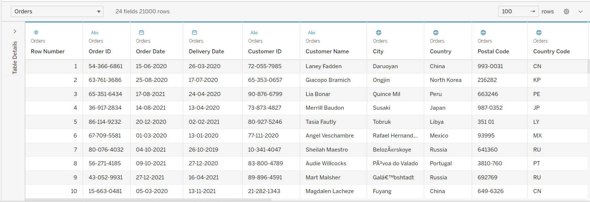

## [Database Engineer Capstone]
Link: https://www.coursera.org/learn/database-engineer-capstone

Related skills:
- [MySQL][0]
- MySQL Workbench
- [Tableau - Business Intelligence and Analytics Software][1]
- Python

## Tableau Demo

### Little Lemon Data

- Data Source Page

- Cuisine Sales and Profits

### Global Supper Store Data

- USA Sales Map

- Sales Trend in USA

- USA Profit Bubble Chart

[0]: https://www.mysql.com/
[1]: https://www.tableau.com/